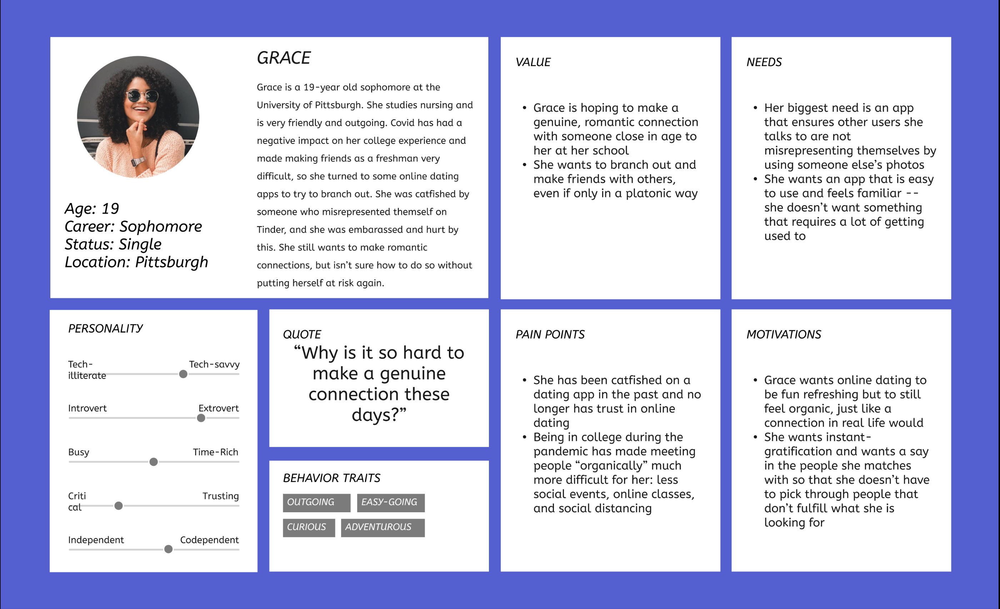
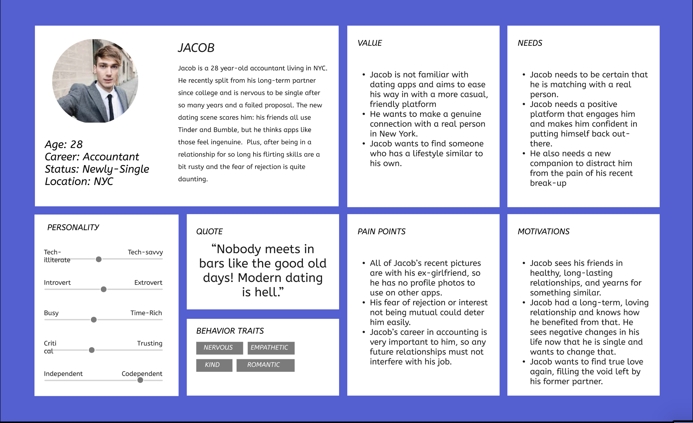
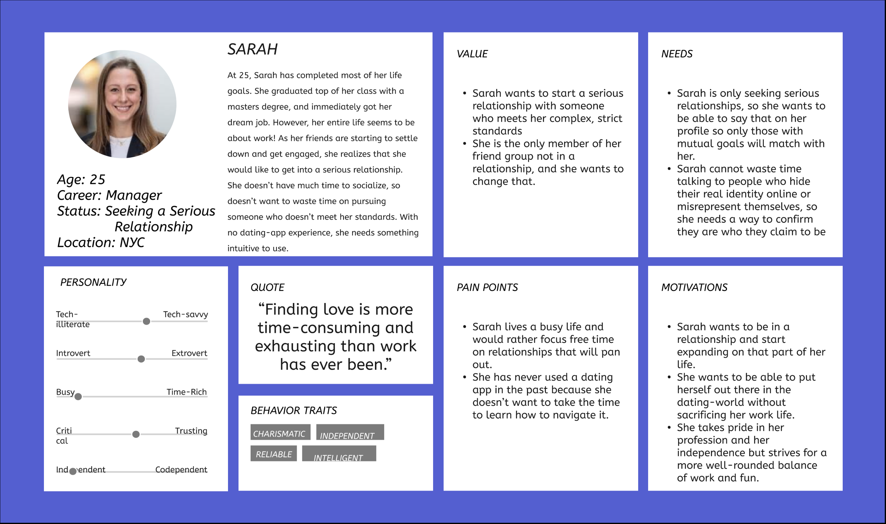

# face2face

face2face is a mobile dating application aimed at connecting users through daily photos.

## Target User

The target user for face2face are adults aged 18-30 who have previous experience with apps like BeReal, Snapchat, and Instagram.
To serve these users, we have kept a User-Interace (UI) that matches like-products, created a easy user-experience, and have developed with personas in mind.

## User Personas




## Getting Started (Development)

If you would like to get started developing for face2face on your own or work on issues please fork the project.

To setup your development environment:

1. Download the Flutter and Dart SDK from their respective links below.

2. (Optional) Install the Flutter plugin for your editor of choice (IntelliJ, VSCode, or Android Studio are recommended).

3. Set your Flutter path using  ```export PATH="$PATH:`pwd`/flutter/bin"```  with "/flutter/bin" referring to your install location.

4. Run `flutter doctor` to debug any issues and list all of the packages you need to install.

5. Run `open -a Simulator` if you are on MacOS, if on Windows, use Android Studio's built in simulator tab.

6. Open the cloned directory in your respective editor and run `flutter run`, your application should start up in the simulator!

## Development Resources

Flutter documentation: https://docs.flutter.dev

Dart documentation: https://dart.dev/guides

Firebase documentation: https://firebase.flutter.dev

## Reporting Bugs

Please follow this template for reporting bugs using Github's Issue Reporting System:
````
#### Issue description


#### Steps to reproduce the issue
1.  
2. 
3. 


#### What's the expected result?
-


#### What's the actual result?
-


#### Additional details / screenshot

- 
````